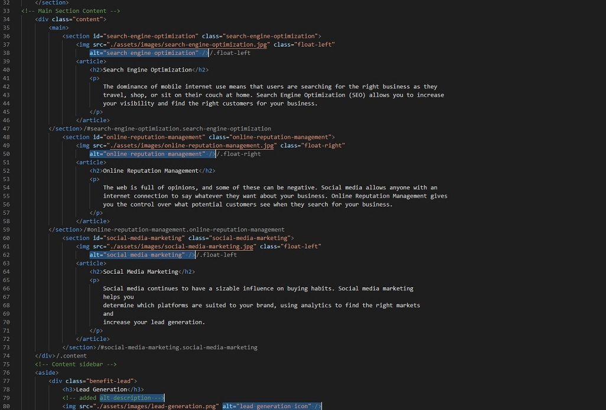
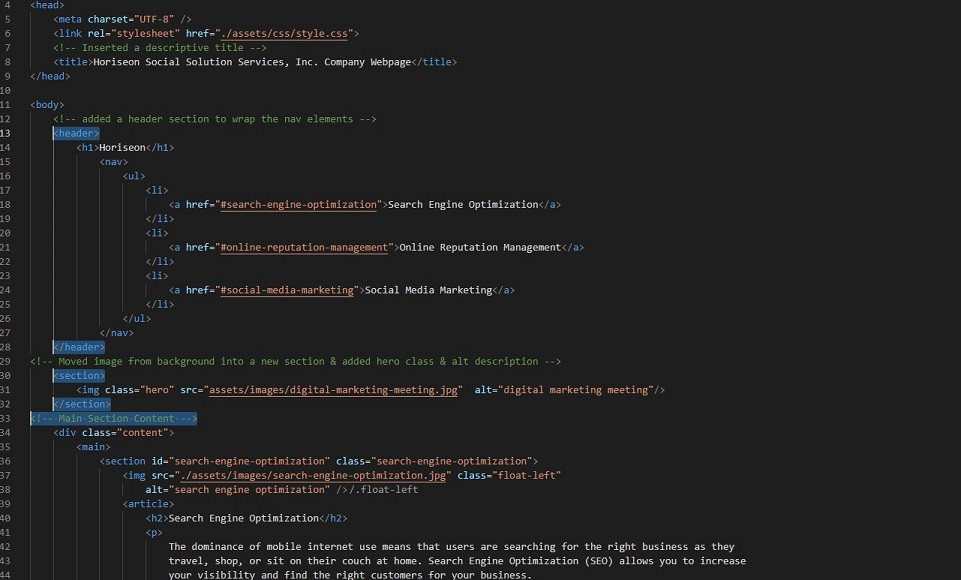

# HTML CSS Git Challenge: Code Refactor

## Description 

The starter version of the Horiseon webpage was fine visually however is was missing key accessibility features. Inspection of the index.html & style.css files revealed that the page was missing key accessibility features, additionally some of the code was unnecessary and could be 'coded out' for the page to render as intended whilst improving overall efficiency.

In order to improve accessibility and enhance the user experience for those relying on accessibility features, I have reviewed both HTML and CSS developing a more accessible webpage with more streamlined code.

During this project I learned about;
<ul>
    <li><strong>Semantic Elements</strong> to improve accessibility & accurately describe the purpose of the elements on a web page.</li>
    <li><strong>HTML Comments</strong> as a means of describing code to help explain what the code is doing.</li>
    <li><strong>Code Simplification</strong> to 'code-out' unnessary code and make it more streamlined.</li>
</ul>

### Result -  
<i>The webpage is now more accessible to everyone & should also benefit from imroved SEO as a result of the changes implemented!</i>

### Here is the deployed site; 
https://sam010000101.github.io/accessibility-review/

## Table of Contents

* [Installation](#installation)
* [Usage](#usage)
* [Credits](#credits)
* [License](#license)

## Installation

N/A

## Usage 
In order to comply with accessibility guidelines, each image was given an alt tag and description, see example below;

Comments have been added to the index.html to explain what the html is doing in key segments. Generic div tags were also replaced with appropriate HTML tags, such as "main", "section", "aside" etc.

## Credits

This project was created in collaboration with my teamates, big shouts out to;
    <li>Victor  Biscio https://github.com/reinkaoss</li>
    <li>Vittoria Bugana https://github.com/vbugana</li>
    <li>Adama Sall</li>
    <li>Chris-Eric Dagbo</li>

## License

MIT License

Copyright (c) 2022 Sam Brooke

Permission is hereby granted, free of charge, to any person obtaining a copy
of this software and associated documentation files (the "Software"), to deal
in the Software without restriction, including without limitation the rights
to use, copy, modify, merge, publish, distribute, sublicense, and/or sell
copies of the Software, and to permit persons to whom the Software is
furnished to do so, subject to the following conditions:

The above copyright notice and this permission notice shall be included in all
copies or substantial portions of the Software.

THE SOFTWARE IS PROVIDED "AS IS", WITHOUT WARRANTY OF ANY KIND, EXPRESS OR
IMPLIED, INCLUDING BUT NOT LIMITED TO THE WARRANTIES OF MERCHANTABILITY,
FITNESS FOR A PARTICULAR PURPOSE AND NONINFRINGEMENT. IN NO EVENT SHALL THE
AUTHORS OR COPYRIGHT HOLDERS BE LIABLE FOR ANY CLAIM, DAMAGES OR OTHER
LIABILITY, WHETHER IN AN ACTION OF CONTRACT, TORT OR OTHERWISE, ARISING FROM,
OUT OF OR IN CONNECTION WITH THE SOFTWARE OR THE USE OR OTHER DEALINGS IN THE
SOFTWARE

---

## Badges

## Features

If your project has a lot of features, consider adding a heading called "Features" and listing them there.

## Tests

Final landing page deployed, fully functional after all elements have been properly replaced. 

---

© 2022 Trilogy Education Services, LLC, a 2U, Inc. brand. Confidential and Proprietary. All Rights Reserved.
